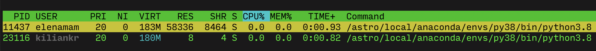

# Tunneling to Jupyter

Let's say we want to use port `8888` both locally and on `beehive`.

Just in case, check open local ports on your Mac:

```
$ netstat -anvp tcp | awk '{ if (($6 == "LISTEN") && ($1 == "tcp4")) { print $4 } }'
```

Verify that `8888` is available.

Then check open ports on `beehive`:

```
$ ssh -J login.uio.no beehive
$ netstat -lntup | awk '{ if (($1 == "tcp") && ($6 == "LISTEN")) { print } }'
```

Also verify that `8888` is available.

Run Jupyter:

```
$ module list
Currently Loaded Modulefiles:
  1) Intel_parallel_studio/2018/3.051   3) python/3.8                         5) gcc/9.3.1
  2) hdf5/Intel/1.10.1                  4) git/2.9
$ which jupyter
/astro/local/anaconda/envs/py38/bin/jupyter
$ cd ~/code/rh/doc/notebooks/
$ jupyter lab --no-browser
```

If the `8888` port is available, it should successfully bind to it. If this port is not available, check if you already have Jupyter running on beehive:

```
$ ps -u | grep jupyter
```

If you do, then either just use its port or kill the process and start new. One more thing I noticed is that there could be Jupyter instances running from other users:



so I'm a bit confused whether they are actually on the same host, so they can take ports. If they can, then you need to run Jupyter on a different port.

Either way, having established that you have `8888` port available both on your Mac and on `beehive`, tunnel to it from your Mac:

```
$ ssh -N -L 8888:localhost:8888 -J login.uio.no beehive -v
```

Now you should be able to open http://localhost:8888 in your browser (*or connect to it from VS Code*).
